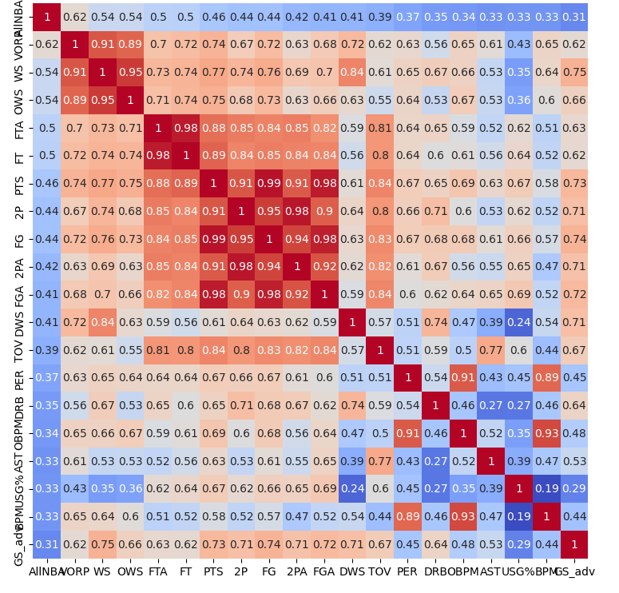
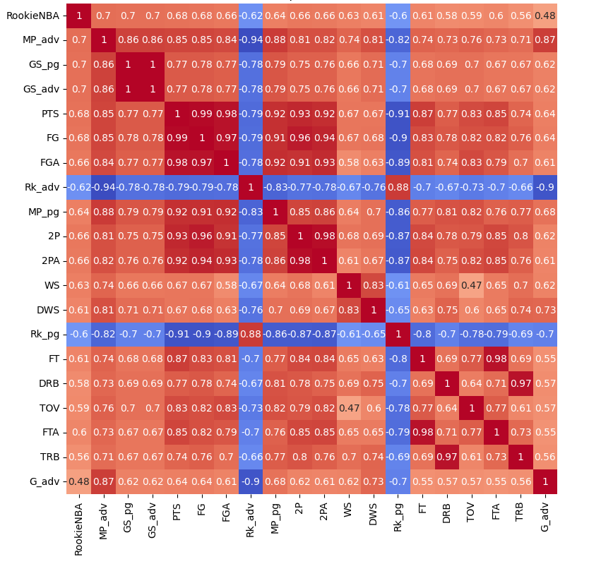
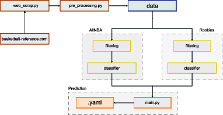

# WZUM Projekt – Klasyfikacja Graczy NBA

**Autor:** Bartłomiej Biesiada  
**Data:** Czerwiec 2025

---

## Opis rozwiązania

### Przygotowanie danych

Dane zostały pobrane z oficjalnego API `nba.com` oraz uzupełnione poprzez web scraping z `basketball-reference.com` za pomocą skryptu `web_scrap.py`. Następnie:

- Przeprowadzono czyszczenie i łączenie danych (`pre_proccesing.py`).
- Dodano informacje o nagrodach All-NBA i All-Rookie na podstawie plików z wynikami.
- Przeanalizowano korelacje zmiennych z klasą docelową (nagroda), co posłużyło do wyboru najbardziej znaczących cech.

W przypadku graczy debiutujących uwzględniono wyłącznie tych z formalnym statusem *rookie*.

**Filtracja:** gracze z mniej niż 64 meczami w sezonie zostali usunięci.





**Finalne cechy:**

- **Wspólne:** `PTS`, `DRB`, `TOV` (z `per_game`)
- **All-NBA:** `VORP`, `DWS`, `PER`, `G` (z `advanced`), `FTA`, `PTS` (z `per_game`)
- **Rookie:** `GS`, `MP`, `WS` (z `advanced`), `2P`, `FT` (z `per_game`)

Wizualizacje korelacji dostępne w repozytorium:
- `Corr_map.png` (All-NBA)
- `corr_map_rookie.png` (Rookies)

---

### Schemat klasyfikatora

Zaprojektowano **klasyfikator warstwowy**. Dane przechodzą przez dwa modele filtrujące, które wybierają top 30 zawodników sezonu. Następnie dane trafiają do głównego klasyfikatora.



**Użyte biblioteki modeli:**  
`scikit-learn`, `catboost`, `xgboost`

**Modele filtrujące:**
```
Logistic Regression
Random Forest
Gradient Boosting
AdaBoost
SVC
GaussianNB
k-Nearest Neighbors
CatBoost
XGBoost
```

**Modele końcowe:**
```
Logistic Regression
Random Forest
Gradient Boosting
AdaBoost
SVC
GaussianNB
k-Nearest Neighbors
CatBoost
```

**Najlepszy wynik:**
- **554 punkty**
- Konfiguracja: `GaussianNB` jako filtr + `Random Forest` jako klasyfikator końcowy

---

### Przykładowe wyniki klasyfikacji

| Kombinacja modeli                        | Wynik |
|-----------------------------------------|--------|
| k-Nearest Neighbors + XGBoost           | 506    |
| AdaBoost + CatBoost                     | 476    |
| Logistic Regression + XGBoost           | 476    |
| k-Nearest Neighbors + Random Forest     | 476    |
| Logistic Regression + k-Nearest Neighbors | 462  |
| SVC + k-Nearest Neighbors               | 462    |
| Gradient Boosting + k-Nearest Neighbors | 462    |
| Random Forest + Random Forest           | 462    |
| CatBoost + Random Forest                | 462    |
| GaussianNB + XGBoost                    | 502    |
| AdaBoost + SVC                          | 500    |

---

### Nieudane podejścia i wnioski

#### 1. `main` branch  
Jeden klasyfikator przypisujący gracza do jednej z sześciu klas (All-NBA, All-Rookie, brak nagrody).  
- **Wynik:** 366 punktów  
- Brak rozdzielenia na rookies i All-NBA wpłynął negatywnie na wyniki.

#### 2. `one_class` branch  
Klasyfikacja binarna: nagroda vs brak nagrody.  
- Następnie przypisanie gracza do konkretnej drużyny na podstawie "pewności predykcji".  
- **Wynik:** 402 punkty  

W obu przypadkach użyto `GridSearchCV` do strojenia hiperparametrów – nie przyniosło to istotnej poprawy, dlatego w finalnej wersji zastosowano proste lub ręcznie dobrane parametry.

---

### Wnioski końcowe

- Podział danych na osobne klasyfikacje dla All-NBA i All-Rookie poprawił wyniki.
- Wprowadzenie warstwy filtrującej zmniejszyło wpływ licznych przykładów bez nagród.
- Finalny model złożony (filtr + klasyfikator końcowy) osiągnął najlepszy rezultat.
- Projekt ilustruje, jak istotne są dane wejściowe i struktura klasyfikatora w problemach nierównomiernej klasyfikacji.
